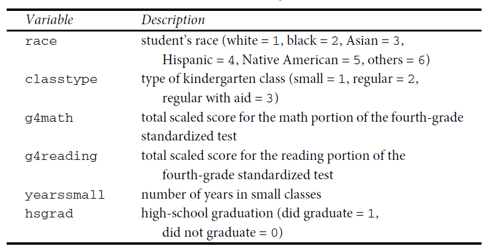
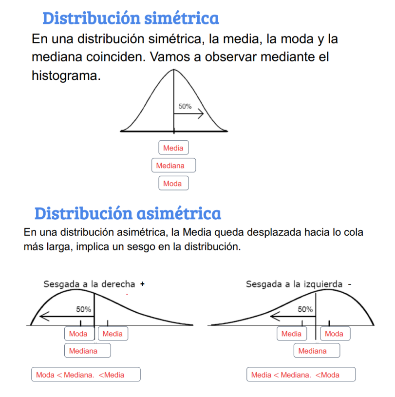

```{=html}
<!--
INPUT YAML:

output:
  html_document: default
  pdf_document: default

-->
```
```{r setup, include=FALSE}
knitr::opts_chunk$set(warning = FALSE, message = FALSE)
```

```{r,echo=FALSE, out.width="40%",fig.align="center"}

```

# **1. Introducción al R y a base de datos**

```{r}
library(rio) # Convocamos el paquete
data = import("https://github.com/Taller-UNMSM-CUANTIPOL-2024-0/SESION-3/raw/main/Mosteller.csv") 
# Utilizamos la función import que creará un objeto en R que contenga la base 
# de datos del archivo "Mosteller.csv" que hemos descargado. Podemos verificar 
# la creación en el environment

class(data) 
# si quieren saber que clase de objeto es el que has creado, utilizamos la 
# función "class" y entre paréntesis colocamos el nombre del objeto. Verán que 
# se trata de un "data frame", es el tipo de objeto en R para las bases de datos.
```

¿Qué otro tipo de objetos existen?

## **Tipos de objetos en R**

Una parte clave para iniciar el manejo del programa es identificar los diversos objetos que podemos crear, manipular y utilizar. Para la definición de objetos en R será necesario previamente tener claridad teórica sobre lo que es una variable categórica nominal, categórica ordinal, numérica discreta y numérica continua.

+------------------------+----------------------------------------------------------------------------------------------------------------------------------------+
| Tipo                   | Descripción                                                                                                                            |
+========================+========================================================================================================================================+
| **Vector Numérico**    | Vector conformado por la concatenación de números, puede representar variables numéricas continuas o discretas. Ej: 1.5 , 2.7 , 3.1    |
+------------------------+----------------------------------------------------------------------------------------------------------------------------------------+
| **Vector de Factores** | Vector que sirve para representar variables categóricas.                                                                               |
|                        |                                                                                                                                        |
|                        | Pudiendo ser factores nominales u ordinales. Ej: "costa", "sierra", "selva"                                                            |
+------------------------+----------------------------------------------------------------------------------------------------------------------------------------+
| **Data frames**        | Son hojas de datos, estructuras similares a una matriz; sin embargo, a diferencia de estas pueden almacenar objetos de distintos tipo. |
|                        |                                                                                                                                        |
|                        | **Generalmente nuestras bases de datos son de este tipo** (como una hoja de Excel que tiene variables numéricas, categóricas, etc).    |
+------------------------+----------------------------------------------------------------------------------------------------------------------------------------+

Los **vectores numéricos** se crean a través de la función **concatenar "c()"**. Vamos a crear un vector que contenga los montos en millones de soles del presupuesto del Estado asignado a las 5 prioridades para el 2021

```{r}
Presupuesto_millones = c(9879, 33132, 20991, 690, 5392) # creamos el vector
# (verifiquemos en el environment)

Presupuesto_millones # invocamos el vector para visualizar su contenido
```

Un **factor** nos permite representar una variable categórica. Se crean a través de la función **"factor()"**, pero antes se crea como vector pues almacena las categorías en la forma de un vector con números discretos integrales (1,2,3,4,etc.), que son códigos de los valores de la variable y otro vector de caracteres interno que contiene las etiquetas de esos códigos. Creemos un factor con los nombres de las prioridades del presupuesto para el 2021:

```{r}
Prioridad = c(1,2,3,4,5) # primero creamos un vector
Prioridad

Prioridad = factor(Prioridad, levels = c(1:5),
                   labels = c("reactivación", "educación", "salud", 
                              "mujer",  "pobreza")) # Lo convertimos en factor. 
# Ojo con los argumentos.

Prioridad # visualizamos su contenido
```

También podemos crear un **factor ordenado** para almacenar información de una variable categórica ordinal. Es casi la misma ruta, solo que añadiremos una función más para convertir el factor en ordinal. Creemos un factor ordinal ficticio que contenga el nivel de ejecución que el Estado ha mostrado en las categorías presupuestales correspondientes a las prioridades, donde 1=Mala, 2=Intermedia y 3= Buena.

```{r}
Ejecucion = c(3, 2, 2, 1, 2) # creamos un vector numérico que registra los datos

Ejecucion = factor(Ejecucion) # Lo convertimos en factor

levels(Ejecucion) = c("Mala", "Intermedia", "Buena") # asignamos levels al factor

Ejecucion = ordered(Ejecucion) # indicamos que se trata de un factor ordinal

Ejecucion # Visualizamos
```

Finalmente, los **data frames** nos permite almacenar un conjunto de datos, es decir una base de datos (bbdd) que tiene filas y columnas. Creemos la base de datos "PP2021" que contenga todos los objetos que hemos creado:

```{r}
PP2021 = data.frame(Prioridad, Presupuesto_millones, Ejecucion)
PP2021 # Visualice la base de datos
str(PP2021) # Visualice la estructura de la bbdd
names(PP2021) #Visualice los nombres de las variables de la bbdd
```

Cuando queramos invocar una variable específica de una base de datos utilizaremos **"\$"**, entre la base de datos y la variable que queremos invocar.

```{r}
PP2021$Prioridad #invocamos la variable prioridad de la base de datos
class(PP2021$Ejecucion) #vemos de que clase es la variable ejecución de la bbdd
```

# **2. ANALISIS DESCRIPTIVO EN R**

Con esta introducción, vamos a comenzar a hacer análisis descriptivo de una base de datos. Antes, limpiemos el environment. Luego, abramos la base de datos que vamos a utilizar (que es la que abrimos antes)

```{r}
library(rio)
data = import("Mosteller.csv") 
```

Esta base de datos pertenece al siguiente paper <https://pubmed.ncbi.nlm.nih.gov/8528684/> Mosteller (1995) realizó un estudio longitudinal sobre el impacto del tamaño de la clase en los primeros grados escolares, sobre el desempeño estudiantil y el desarrollo personal. Un estudio longitudinal es aquel en el que se hace un seguimiento a participantes a lo largo del tiempo. Este estudio en concreto duró de 1985 a 1989 y en él participaron 11.601 estudiantes. Durante los cuatro años del estudio, los estudiantes fueron asignados aleatoriamente a clases pequeñas, a clases de tamaño normal o a clases de tamaño normal con ayuda. Aunque el programa se detuvo en 1989 después de que la primera clase de jardín de infancia del programa terminara el tercer grado, la recopilación de información (por ejemplo, el rendimiento en los exámenes de octavo grado, el promedio general de la escuela secundaria) continuó hasta el final de la asistencia de los participantes a la escuela secundaria.

¿Por qué son importantes este tipo de estudios? Porque constituyen evidencia para los tomadores de decisión de política pública. Pensemos que esto puede contribuir a definir si la política educativa debe apostar por salones de clases con grupos pequeños o no, pensando en fortalecer las competencias de los estudiantes.

Exploramos las variables que tiene nuestra base de datos:

chr, factor, ordered factor, num, int

```{r}
names(data)
str(data)
```

El contenido de cada variable lo podemos ver en la siguiente tabla:

```{r,echo=FALSE, out.width="40%",fig.align="center"}

```

## **2.1. Configuración (CORRECCION) de las variables**

Siempre antes de comenzar a realizar nuestro análisis, debemos identificar la estructura de las variables y verificar que estén bien "configuradas". Es decir que la escala de la variable coincida con el objeto en R.

**De "race"**

```{r}
table(data$race) # Exploramos frecuencias
class(data$race) # Exploramos el formato de la variable
# No es un float (decimal)
```

```{r}
data$race = factor(data$race, levels = c(1:6), labels = c("white","black","asian","hispanic","native american","others")) #Otorgamos formato
table(data$race)
class(data$race)
```

**De "classtype":**

```{r}
class(data$classtype) 
table(data$classtype)
```

```{r}
data$classtype = factor(data$classtype, levels = c(1:3), 
                        labels = c("small","regular","regular with aid"))
str(data$classtype)
table(data$classtype)
class(data$classtype)
```

**De "hsgrad"**

```{r}
class(data$hsgrad) 
table(data$hsgrad)
```

```{r}
data$hsgrad = factor(data$hsgrad, levels = c(0:1), 
                     labels = c("did not graduate", 
                                "did graduate")) # ojo con el orden
table(data$hsgrad) 
class(data$hsgrad)
```

**"g4math", "g4reading", "yearssmall"** son variables numéricas y están configuradas como vectores numéricos de números enteros (integer) por lo cual lo dejamos así.

## **2.2. Estadísticos descriptivos y gráficos**

Entonces, una vez configurados adecuadamente nuestros **objetos**, pidamos los estadísticos de tendencia central para nuestras variables.

Antes instalamos algunos paquetes que utilizaremos

-   **install.packages("DescTools")** para pedir los estadísticos de tendencia central

-   **install.packages("e1071")** para asimetría y curtosis

### 2.2.1. Estadísticos descriptivos y gráficos para VARIABLES CATEGORICAS\*\*

Las variables solicitadas son race, classtype y hsgrad

**Para "race" podemos:**

```{r}
library(DescTools)
Mode(data$race) #este comando nos permitirá calcular la moda
```

```{r}
#Tambien podemos calcular el porcentaje
table(data$race)
prop.table(table(data$race))*100
```

**Para "classtype"**

```{r}
Mode(data$classtype) #examinamos la moda
```

```{r}
table(data$classtype) # hacemos una tabla de frecuencia

prop.table(table(data$classtype))*100 # Sin embargo, esa tabla solo nos muestra la frecuencia absoluta. Con este comando podemos visualizar la frecuencia relativa porcentual
```

**Para "hsgrad"**

```{r}
Mode(data$hsgrad)
```

```{r}
table(data$hsgrad)
prop.table(table(data$hsgrad))*100
```

Ahora vamos a graficar!!

**Para "hsgrad" podemos**

#
```{r}
grafico1 <- table(data$hsgrad) # creamos un objeto que contenga 
# la tabla de frecuencias dela variable
pie(grafico1) # con el comando pie creamos un gráfico de ese objeto
pie(grafico1, main = "graduacion 2023") # Argumento main: colocamos el título


```

**Para "classtype" podemos:**

```{r}
grafico2 <- table(data$classtype)
barplot(grafico2) #este comando nos permite hacer un gráfico de barras
barplot(grafico2,
        xlab = NULL,
        ylab = "Estudiantes",
        main = "Tipo de clase") # agregando estos argumentos estamos 
# estableciendo un nombre al eje "y", así como un título al gráfico
```

### 2.2.2. Estadísticos descriptivos y gráficos para VARIABLES NUMERICAS\*\*

**Para "g4math" podemos**

```{r}
summary(data$g4math) # el comando summary nos da los cuartiles y 
# estadísticos de tendencia central de una variable numérica

# Podremos hallar la mediana (Median) y la Media (Mean):
```

#### DESVIACION ESTANDAR

```{r}
sd(data$g4math) # este comando nos permite calcular la desviación estándar
```

Entonces los valores individuales tienen alejarse de la media en unos 41.6

#### VARIANZA

```{r}
var(data$g4math) #este comando nos permite calcular la varianza
```

Al ser una varianza alta, sugiere que los datos estan mas dispersos - porque la varianza es mayor que el rango

#### RANGO

```{r}
rango = max(data$g4math) - min(data$g4math)
rango
```

Nos dice la diferencia entre el maximo y minimo de los datos

#### ASIMETRIA

```{r}
library(e1071)
skewness(data$g4math) #Asimetría
```

La ASIMETRIA NEGATIVA indica que la distribucion de los datos esta sesgada hacia la izquierda =\> hay mas valores debajo de la media que mayores que esta

####KURTOSIS Si la kurtosis es alta, es porque los valores estan concentrados cerca de la media y no en los extemos. Mientras que si la kurtosis es baja, los valores estaran dispersos

```{r}
kurtosis(data$g4math)
```

Como la kurtosis es mayor a 3, significa que tiene "colas" mas pesadas que una distribucion normal =\> osea, presencia de valores atipicos en el conjunto de datos

Ahora vamos a graficar!!

```{r}
# Solicitamos un histograma
hist(data$g4math)
```

```{r}
# Gráfico de boxplot (o de cajas y bigotes)
boxplot(data$g4math)
```

```{r}
boxplot(data$g4math ~ data$classtype)
```

```{r,echo=FALSE, out.width="100%",fig.align="center"}

```


REPASO:

VARIABLES CATEGORICAS (FACTOR)

- V.C. NOMINAL: moda

- Graficos: de barras (barplot) y piechaart (sectores). No olvidar guardar en obejeto la tabla creada. O crear un dataframe (ggplot2)

- V.C. ORDINALES: Mediana y moda

- Graficos: de barras (barplot), piechaart (sectores) y Grafico de cajas. No olvidar guardar en obejeto la tabla creada. O crear un dataframe (ggplot2)


VARIABLES NUMERICAS: 

- TENDENCIA CENTRAL, PERCENTILES (summary), distribución, dispersión.

- Graficas: Histograma y Grafico de cajas (boxplot)


## **REFERENCIAS**:

- POL278 - Estadística para el análisis político 1. Jefes de práctica: Alexander Benites, Reyna Osorio, Gabriel Ramos y Almendra Rodriguez.


- [Plantilla de los principales comandos del curso ESTADISTICA PARA EL ANALISIS POLITICO 1](https://github.com/Pruebas-Estadistica-2/REPASO-CODES)


El contenido de este curso se ofrece bajo una licencia [Dominio público](https://en.wikipedia.org/wiki/Public_domain). El contenido de este curso puede considerarse bajo esta licencia a menos que se notifique de manera diferente.
